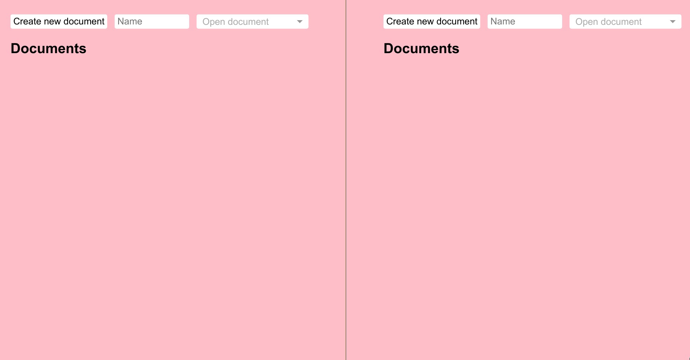

EXPERIMENTAL

p2p collaborative document editing, built on [`hypermerge`](https://github.com/automerge/hypermerge).

# Usage

1. Clone this repo
2. `npm install`
3. `npm run compile`
4. `npm start`

# To figure out

- What's the best way to share docs/invite people? Just rely on other messaging services?
- Buggy when `path` is not `ram`.
    - May be related to: <https://github.com/automerge/automerge/issues/92>